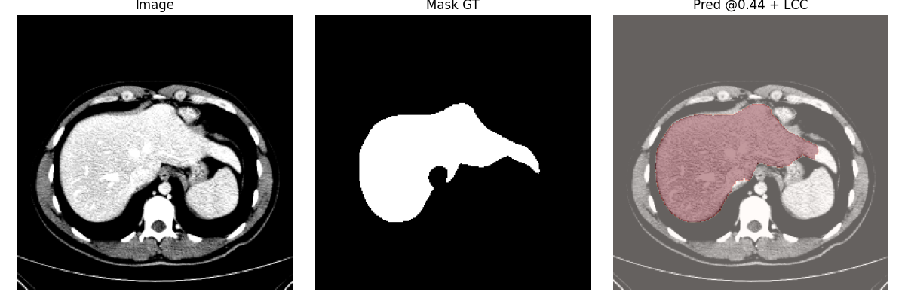
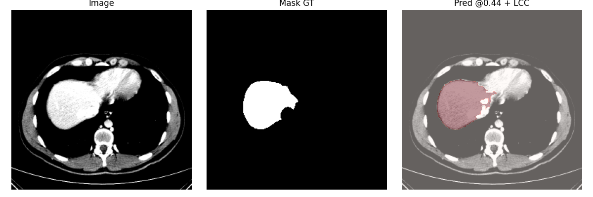
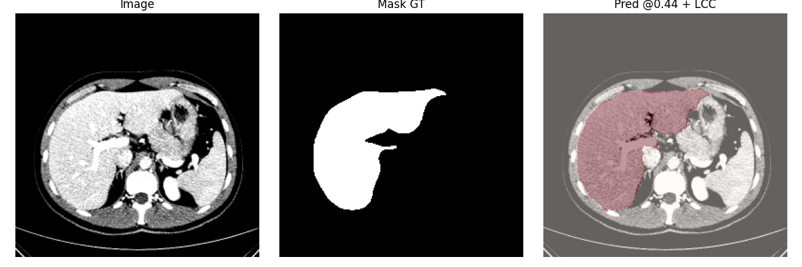

# CHAOS Liver Segmentation (U-Net)

## 📌 Description
Projet de segmentation automatique du foie sur le dataset médical **CHAOS (CT)** à l’aide d’un modèle **U-Net** en TensorFlow/Keras.  
Objectif : détecter et segmenter le foie à partir d’images DICOM (CT-Scan).  

## ⚙️ Pipeline
- **Prétraitement :**  
  - Lecture DICOM → conversion HU → fenêtre foie (center=60, width=150)  
  - Normalisation [0,1]  
  - Resize 256×256  

- **Masques :**  
  - Binarisation (0/1)  
  - Resize avec interpolation nearest  

- **Split dataset :**  
  - Split par patient (80% train / 20% val)  

- **Modèle :**  
  - Architecture U-Net  
  - Loss = Binary Crossentropy + Soft Dice  
  - Optimizer = Adam  

- **Évaluation :**  
  - Balayage de seuils (0.1–0.6)  
  - Post-processing Largest Connected Component (LCC)  

## 📊 Résultats
- **Validation Dice (post-processing) : ~0.71**  
- **Validation IoU (post-processing) : ~0.68**  

Quelques résultats visuels sont disponibles dans le dossier [`results/`](./results).  

## 📸 Exemples de résultats

  
  
  
 

> ⚠️ Les images affichées ici sont issues du jeu de validation.

## 🚀 Utilisation
1. Télécharger le dataset CHAOS (CT).  
2. Placer le dossier `Train_Sets/CT/` dans le projet.  
3. Lancer le notebook [`CHAOS_UNet_clean.ipynb`](./CHAOS_UNet_clean.ipynb).  
4. Le modèle pré-entraîné `unet_dicom_best.h5` peut être utilisé pour éviter de relancer l’entraînement (~6h).  

## 📂 Contenu du repo
- `CHAOS_UNet_clean.ipynb` → Notebook complet (propre)  
- `results/` → Images d’exemples + courbes d’entraînement  

## 📜 Licence
Projet libre à usage académique.  

